# Build Guide

The build process is the same for 38 and 40 keys versions, but files are different, please order carefully.

## Gerber files

- Main PCB - [mx40](/gerbers/mx40.zip) or [mx38](/gerbers/mx38.zip)
- for Azoteq touchpad only - [VIK adapter](https://github.com/sadekbaroudi/vik/tree/master/pcb/azoteq-tps) (or solder wires directly instead)
- for bare 2" display only - [VIK adapter](https://github.com/zzeneg/vik-display-adapter) (universal pcb 0.7/0.8mm pitch - **must** match your display)

## Case files (3d printed)

Main files - in [mx40](/case/mx40) and [mx38](/case/mx38) folders:

- 5mm plate for MX switches
- 2.5mm plate for KS-27/KS-33 switches
- versions for `rotary` and `roller` encoders

Covers - in [covers](/case/covers) folder:

- `left`/`right` versions for asymmetric covers

## Materials

- PCBs
- 3D printed case (6 parts)
- 2 Waveshare [RP2040 Zero](https://www.aliexpress.com/item/3256804090654134.html) MCUs
- 42 [SMD SOD-123 1N4148](https://www.aliexpress.com/item/1005002882901030.html) diodes
- 2 [EC11/12 rotary encoder](https://www.aliexpress.com/item/33006686909.html) with [knob](https://www.aliexpress.com/item/1005003425428192.html) or [Panasonic EVQWGD001 roller encoder](https://www.aliexpress.com/item/32990950196.html)
- 8mm (ideally 9mm) for MX or 6mm for KS, 14mm for covers [M2 screws with flat head](https://www.aliexpress.com/item/4001248931159.html)
- M2 [nuts](https://www.aliexpress.com/item/1005001412230125.html)
- M2 [heatset inserts](https://www.aliexpress.com/item/1005004624377733.html) - 4mm length, 3.2mm diameter for resin case or 3.5mm for Nylon/PLA
- One display:
  - LCD 1.69" 240x280 [display](https://www.aliexpress.com/item/1005004922900927.html)
  - LCD 1.28" round [display](https://www.aliexpress.com/item/1005004069703494.html) - "square" option, with 8 corners
  - Bare LCD 2" round [display](https://www.aliexpress.com/item/1416043398.html) - **VIK adapter required** (that link uses 0.8mm pitch, others may use 0.7mm)
- One touchpad:
  - Cirque 40mm with flat or curved overlay
  - Azoteq TPS43
- Right angled PH2.0 8pin [male connector](https://www.aliexpress.com/item/1005003115054198.html)
- PH2.0 8pin [female connector with wires](https://www.aliexpress.com/item/4000130210271.html)
- [Vertical](https://www.aliexpress.com/item/10000000737049.html) 12pin FFC/FPC connectors
- 12pin 0.5mm pitch 6cm/10cm [FFC cable](https://www.aliexpress.com/item/1005002468369055.html) - **both reverse and forward variants**
- TRRS [connectors](https://www.aliexpress.com/item/4000661212458.html) and [cable](https://www.aliexpress.com/item/1005003676559658.html) - **38 keys version only**
- USB-C [16pin connectors](https://www.aliexpress.com/item/1005003670899595.html) and [cable](https://www.aliexpress.com/item/1005004649061153.html)
- 40 [RGB LEDs 3mA](https://www.aliexpress.com/item/1005003636607308.html)
- [7x1.5mm legs](https://www.aliexpress.com/item/1005002995402961.html)
- optional - 8mm magnets (2mm height)

## Tools

- Soldering iron. Any iron will work, but I highly recommend something small like TS100 or Pinecil with TS-K tip, it's good for SMD soldering
- Solder, preferably with lead if you can get one. For EU I recommend this [shop](https://botland.store) and Cynel brand. 0.56mm is great for SMD, and you can optionally get 0.9mm for hotswap sockets
- [Flux](https://www.aliexpress.com/item/1005004441105643.html)
- Tweezers (I prefer [reverse](https://www.aliexpress.com/item/1005004188266714.html) instead of regular), pliers, soldering mat, isopropyl alcohol (IPA) and [cotton pads](https://www.aliexpress.com/item/1005003798227116.html) for cleaning

## Build

Start with breaking the combined PCB into two halves using pliers. You can sand down the breaking points or just polish with a sharp knife. Just a bit, small pieces of PCB material are pretty bad for breathing in. Choose left or right half and place it upside down, we'll start from bottom side.

### LEDs

First of all, LEDs can be destroyed with heat, so be careful - use lower temp (something like 300C or lower depending on your solder) and don't hold the iron longer that needed. Second, be careful with placing the LED, they are not symmetrical. One pin (ground) is chamfered, it must be placed on a pad with similar shape (left bottom if you look on it).

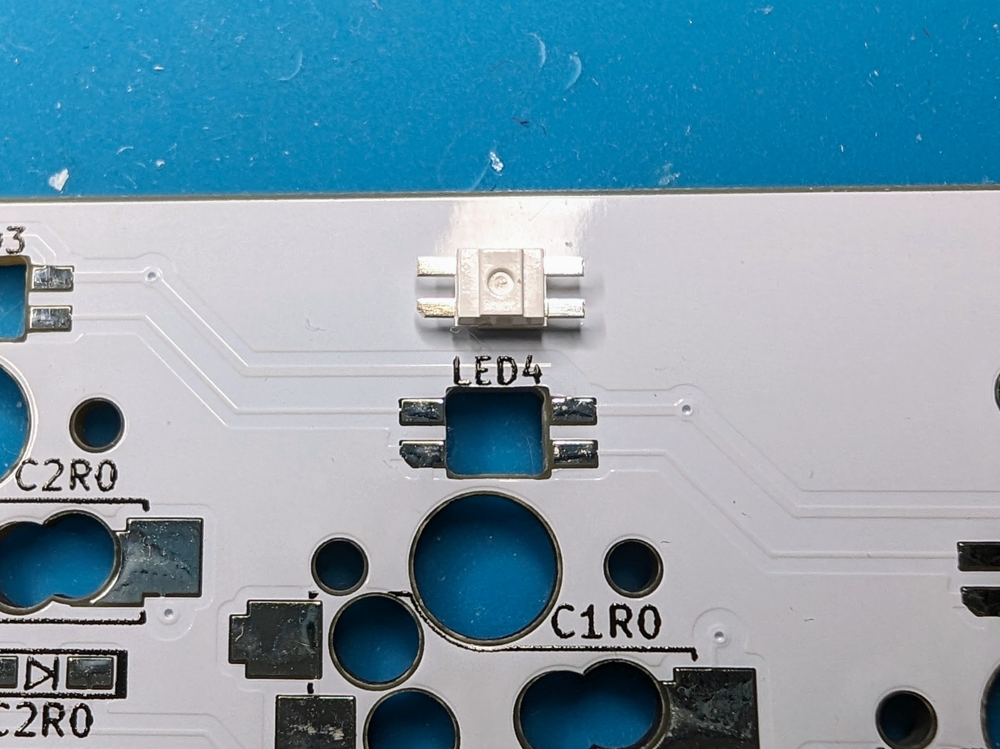

There are several ways of soldering them, my favorite is:

- pre-tin all 4 pads 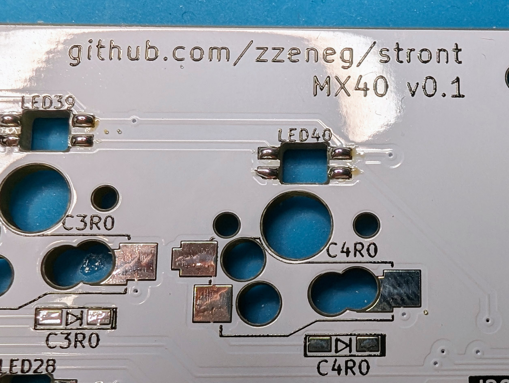
- put a LED into place and press it gently with your fingernail or tweezers
- use TS-K tip to heat two pads and pins at the same time 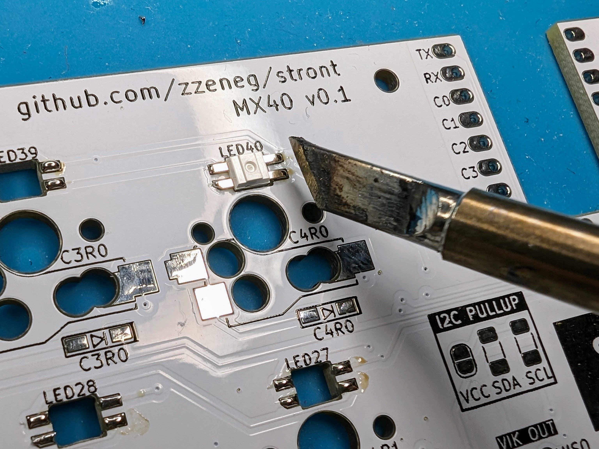
- do the same for other two pins
- repeat it for all LEDs

If you don't have a TS-K tip, just do all the pins one by one. The most important thing is to heat pin and pad simultaneously, otherwise you may have cold joints. You can experiment with solder paster and/or flux but I felt like it takes more time without any benefits.

### Diodes

Again, orientation is important. Every diode has a vertical line on it marking the side with cathode, experiment with lighting and angle if you don't see it.

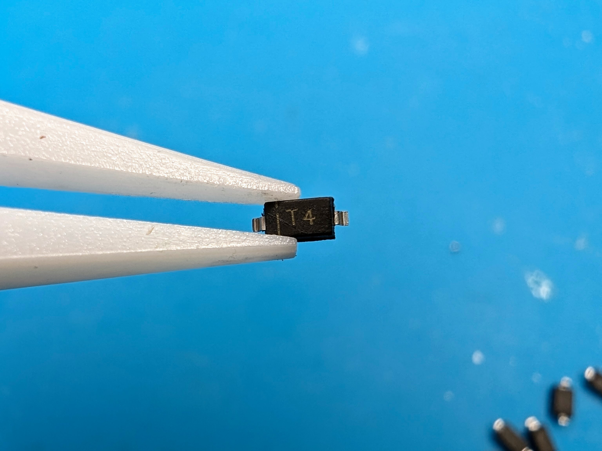

On the PCB cathode is marked with a thick outside line and a vertical line between pads. Here on the photo cathode pad is soldered.

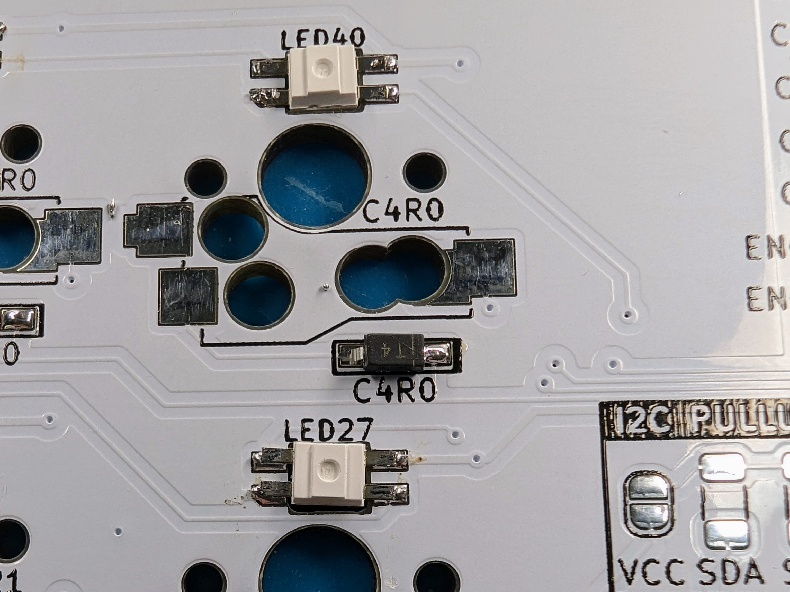

Soldering order:

- tin one pad (doesn't really matter which one, what's important is consistency)
- grab a diode with tweezers and make sure it's oriented correctly
- place it next to the tinned pad, heat the solder blob, put the diode to its place and press it down with fingernail
- solder the second pin by simultaneously heating the pad, pin and solder wire

Repeat it for all diodes, then clean everything with IPA.

### Hotswap sockets

These are also asymmetrical but orientation does not really matter. You can still orient all of them in same way, border lines on PCB should help with that. If you have thick solder wire - use it, you'd need much more solder here compared to LEDs/diodes. Soldering process is the same as for diodes - pre-tin one side, put the socket, heat solder and push it into place. Solder second pin, repeat for all others.

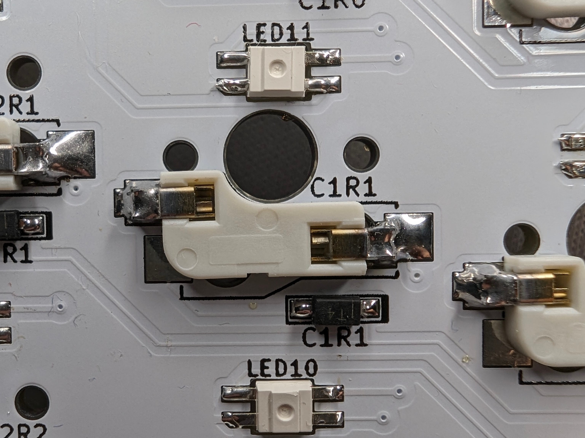

Clean it with IPA, it's a bit harder with sockets but do your best.

### MCU

We're done with bottom side, so **FLIP THE PCB**. MCU goes on top side, so triple check it, you really-really don't want to solder it on the bottom side (I did it once so I know what I'm talking about). Also, I recommend to flash the MCU before soldering, I didn't see a dead one yet but you never know. Connect it to the computer and put a precompiled firmware file into a disk that would appear.

Soldering process:

- pre-tin one (any) pad
- place the MCU on pads, heat the pre-tinned pad and move MCU into correct place (all holes must match), you can use pinhead/socket row to align it
- solder a pad on the opposite side of the MCU to hold it in place
- go through all pads one by one and solder them
- double check everything, it may be tricky to solder the PCB's pads sometimes but it's easy to spot it

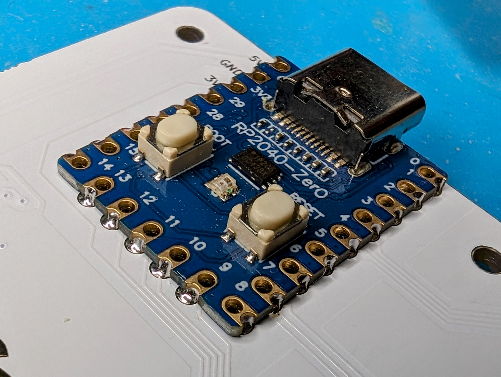

### USB-C connector

- insert the connector into holes and solder one leg from the bottom side (just to hold it in place) 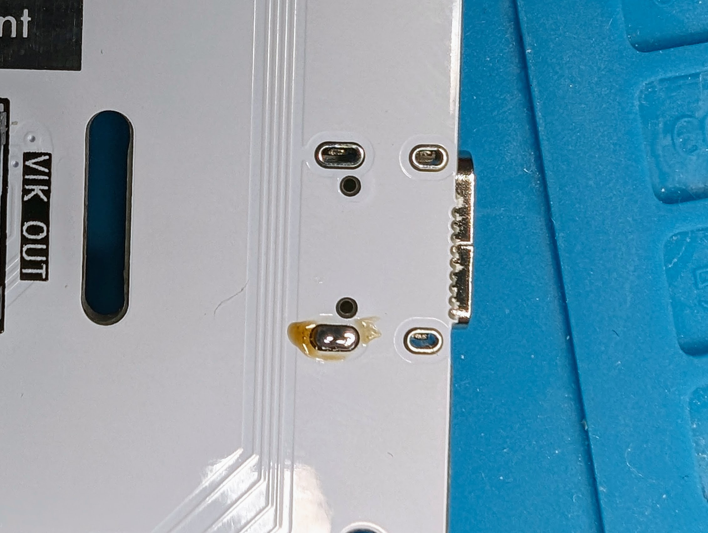
- put flux on pads, add small amounts of solder and carefully heat each pin one by one heat the pads and solder paste.
- if some pins are shorted - add flux and move tip from the connector to outside and remove extra solder 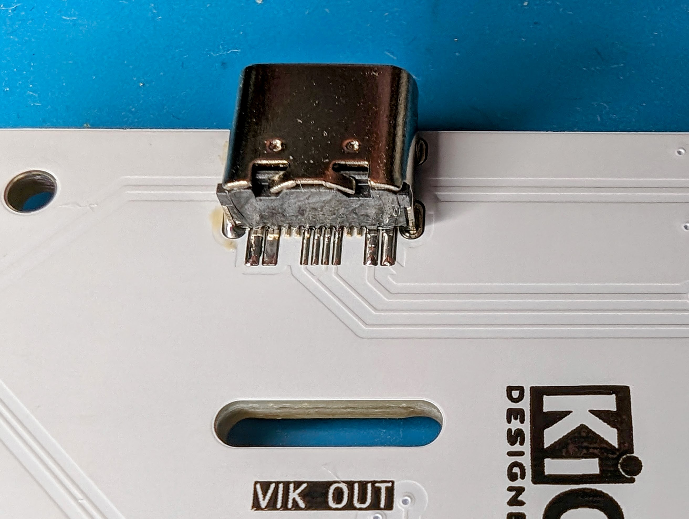
- when pads are done, solder other legs from bottom side, add more solder to make sure it's firmly soldered but remove extras afterwards (solder must be flat with PCB, no blobs)
- I recommend to solder legs on top side as well 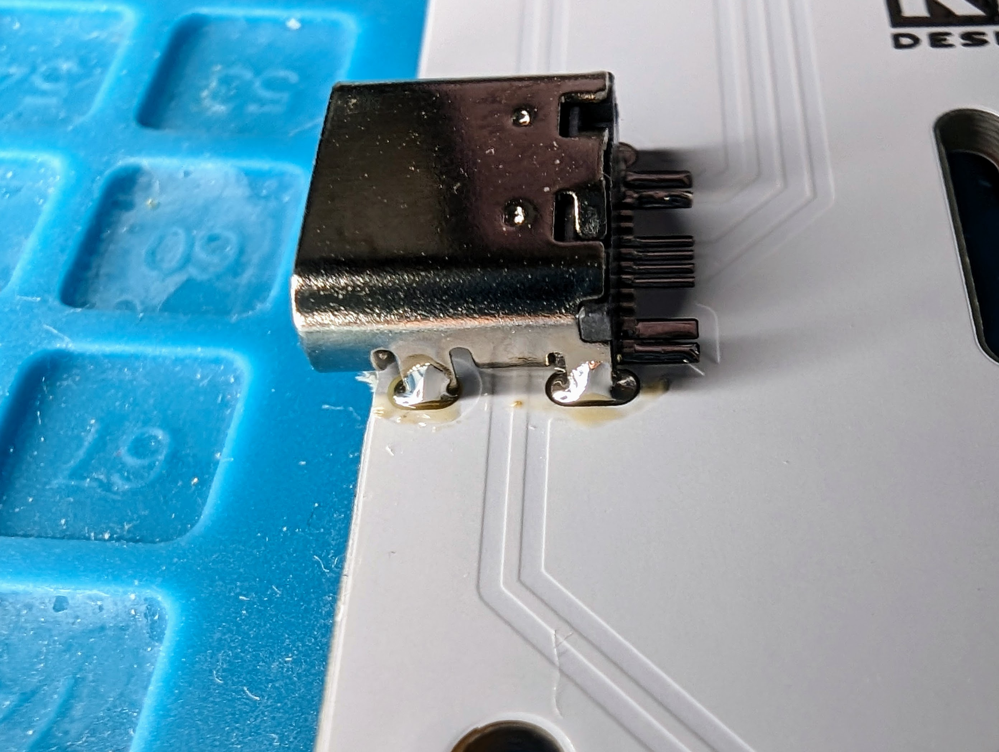

**DO NOT CONNECT THAT USB-C TO YOUR PC, IT'S ONLY FOR INTERCONNECT BETWEEN LEFT AND RIGHT SIDES**

### TRRS connector - MX38 version only ⚠️

You can solder TRRS connector if you want, remember to always disconnect power before unplugging it. It's super easy, so no photos.

### Second half - repeat all previous steps

### Roller/rotary encoders

Choose your encoders and solder them, there's only one way to solder it. I prefer to cut pins before soldering to get small pretty solder blobs.

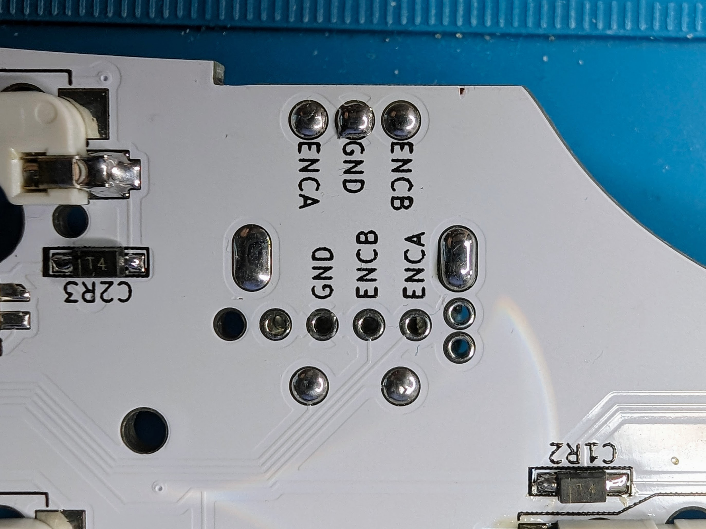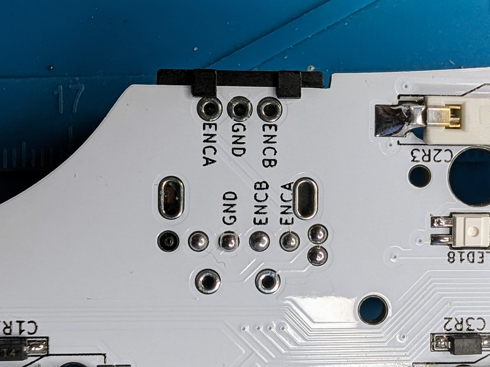

### Vertical FFC connector (VIK/Cirque/Bare display)

> Skip this if using Azoteq without VIK adapter. Solder wires directly from Azoteq to testing pads on the PCB (VCC/GND/SDA/SCL).

Pretty similar to USB-C connector but easier thanks to 1mm space between pins. Also if you fail the step you can use a [daughterboard](https://www.aliexpress.com/item/4001156449357.html) (0.5mm pitch, 12 pins), it matches the holes on the PCB.

- place connector with black moving part facing the switches (if you messed up here, don't worry and just use another cable during assembly)
- tin one square mounting pad, align small pins to pads and solder big pad 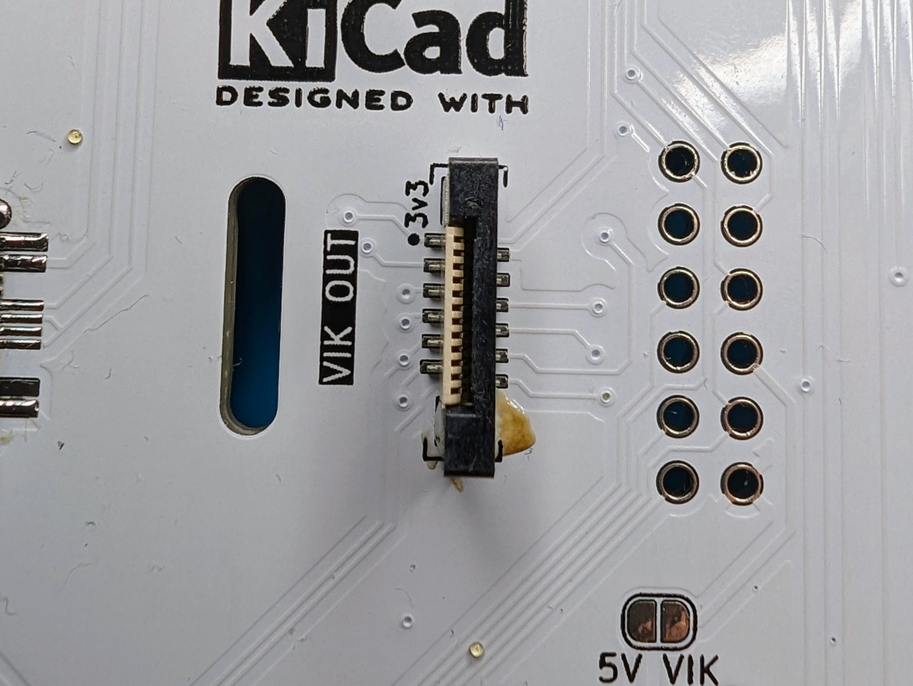
- carefully solder pins one by one
- make sure there are no bridges and solder the second mounting pad
- you can desolder and restart in case of shorts or bad placement, but be careful not to lift pads - move the connector horizontally, not vertically

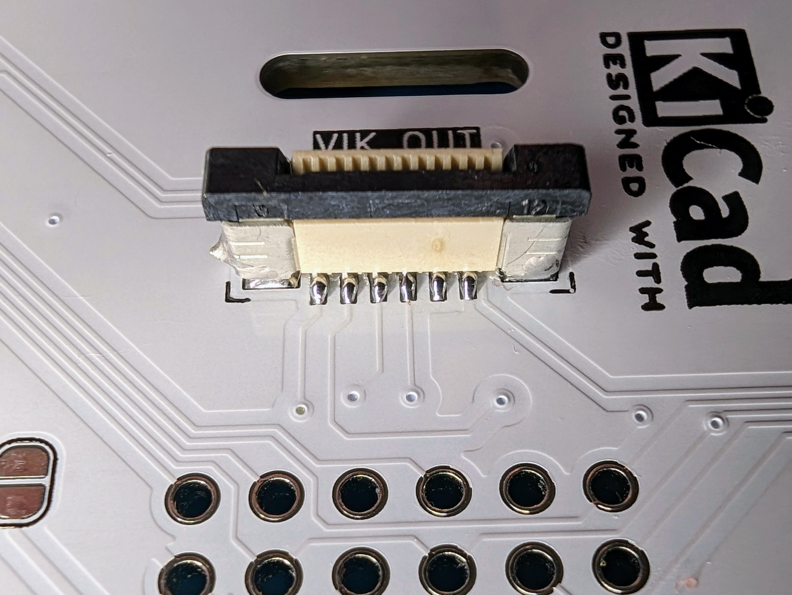

### Display

> Skip this if using VIK for the display. Assemble the [adapter](https://github.com/zzeneg/vik-display-adapter) instead.

Start with adding male connector to the PCB.

Take a female connector with wires and cut them to 5cm. Make sure the connector is correctly oriented (when inserted into PCB the display should be facing up) and solder them. Cut wires/solder blobs on top afterwards so that display's PCB is flat. You can hot glue wires to display to secure them in place.

### Testing/flashing

At this point you can connect everything and test the keyboard. Again, be extra careful with USB-C ports.

- grab default [pre-compiled firmware](./../firmware/qmk/stront_default.uf2)
- connect one side to PC and go into bootloader by double pressing reset button
- copy the file onto the disk that would appear
- repeat for second half
- firmware has [EE_HANDS](https://docs.qmk.fm/#/feature_split_keyboard?id=handedness-by-eeprom) enabled so any side can be master. You'd have to specify left or right side by pressing key combinations - hold inner thumb key, then hold outer thumb key to activate SYSTEM layer. Now press outer bottom pinky key for left side or inner bottom index key for right side (insert switches into those places). E.g.

  - if your left side is detected as right side, do this:

  

  - if your right side is detected as left side, do this:

  

  See [keymap](https://github.com/zzeneg/qmk_firmware/blob/feature/stront/keyboards/stront/keymaps/default/keymap.c) for better understanding. **Reconnect the keyboard to apply changes.**

- test display and touchpad
- test all keys - insert switches or short sockets with something like metal tweezers or TRRS cable
- test encoders
- test USB-C interconnect in all 4 possible cable positions
- test LEDs - press or lightly tap each LED with your fingers to make sure the soldering is fine, there should be no flickering
- in case of any issues go to troubleshooting section

### Assembly

- add heatset inserts into covers
  - for Nylon/PLA use 3.5mm diameter and insert them with soldering iron or special heat gun
  - for resin use 3.2mm diameter and super glue. DO NOT apply heat to resin case! If the hole is too small, just drill it to the correct size
- insert modules (display/touchpads) into covers, secure them in place with hot glue on the inside
- insert PCB into case. Inserting USB-C/TRRS connectors will require just a bit of force
- connect FFC and display cables, check continuity (or examine 3v3 label visually), try forward/reverse FFC cables if needed. FFC cables can be bent as needed.
- flash correct firmware for each side, test that display and touchpad are working
- insert 5 nuts into bottom case
- attach bottom case with 14mm and 6mm/8mm screws. If the 8mm screws for MX seem too short, try to tighten the hex with a long screw first.
- add legs and magnets if needed
- add switches and knobs

Examples:

- round display
  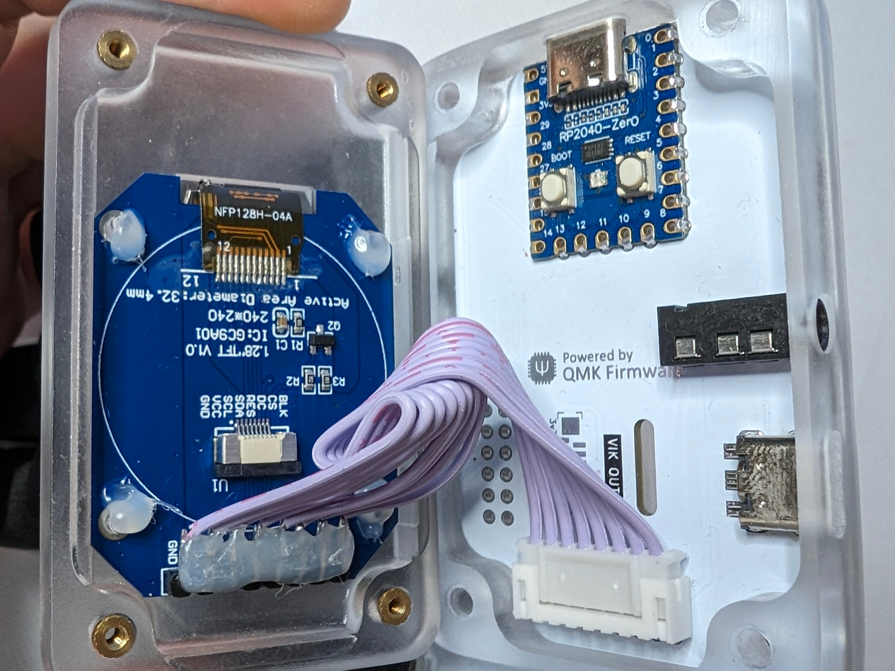
- bare display with adapter
  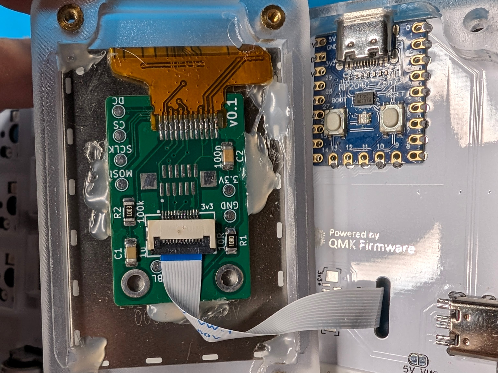
- Azoteq with adapter
  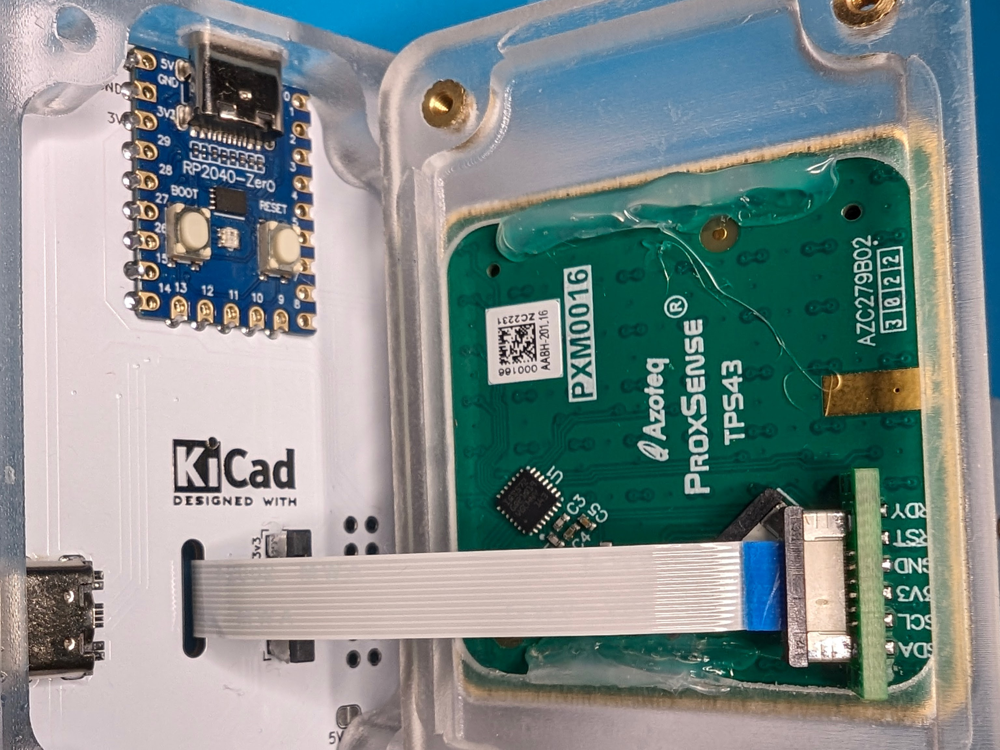

### Troubleshooting

See https://github.com/zzeneg/stront/tree/main/build-guide/choc#troubleshooting
